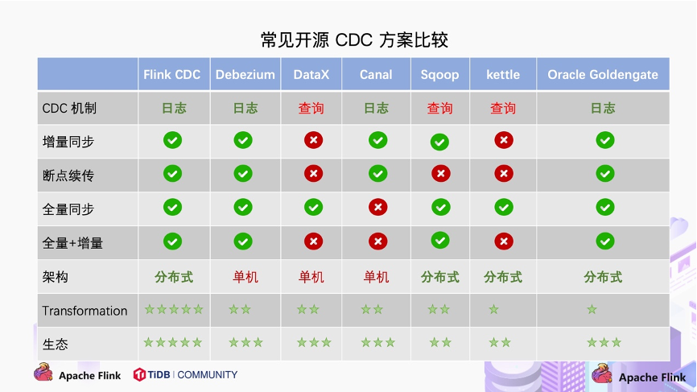

https://jishuin.proginn.com/p/763bfbd6a1f5

Flink CDC 2.0 详解.md
https://github.com/czy006/FlinkClub/blob/main/Flink%20CDC%202.0/Flink%20CDC%202.0%20%E8%AF%A6%E8%A7%A3.md

https://flink-learning.org.cn/article/detail/3ebe9f20774991c4d5eeb75a141d9e1e

Flink SQL CDC实践以及一致性分析
https://www.modb.pro/db/45331

DDL支持
https://github.com/ververica/flink-cdc-connectors/issues/795

flink cdc datastream方式保存到mysql或其他存储中

https://blog.csdn.net/weixin_35757704/article/details/121306250
https://bigdata.bihell.com/hadoop/flink/datastream-api-sink.html#%E8%BE%93%E5%87%BA%E5%88%B0%E6%96%87%E4%BB%B6
https://www.liangzl.com/get-article-detail-232952.html
https://www.studytime.xin/article/flink-mysql-source-sink.html

canal方式

https://www.cnblogs.com/fuzongle/p/12741052.html
